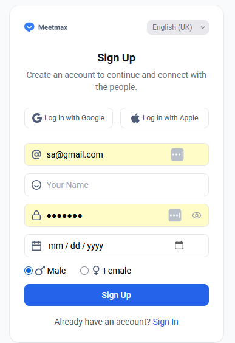
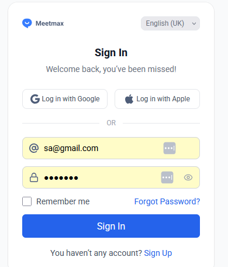
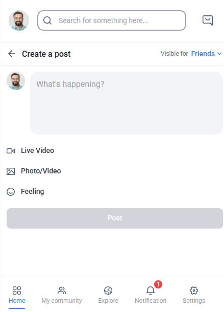
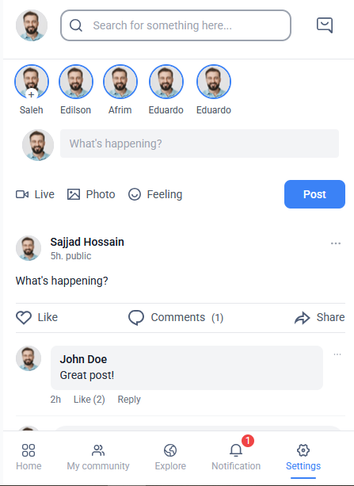

# MeetMax

A modern React application with a clean, mobile-friendly UI, built using Vite and Tailwind CSS.

---

## ✨ Features

- **Authentication Flow**  
  - Simulated login and signup with form validation.
  - Restricts access to the Feed screen for unauthenticated users.
- **Feed Screen**  
  - Only accessible after successful authentication.
- **Post, Like, and Comment**  
  - Users can create posts, like posts, and add comments (all simulated in the frontend).
- **Form Validation**  
  - All forms include validation for required fields and correct formats.
- **Navigation Bar**  
  - Mobile-friendly bottom navigation with active state and notification badge.
- **Responsive UI**  
  - Clean, modern design using Tailwind CSS and Roboto font.
- **No Backend Required**  
  - All API calls are simulated using mock data and localStorage.

---

## 🚀 Setup Instructions

### 1. Clone the Repository

```bash
git clone https://github.com/sani-1023/MeetMax.git
cd MeetMax
```

### 2. Install Dependencies

```bash
npm install
```

### 3. Start the Development Server

```bash
npm run dev
```

Visit [http://localhost:5173](http://localhost:5173) in your browser to view the app.

---

## 🧪 Testing the Application

- Interact with the UI in your browser.
- Try signing up, logging in, creating posts, liking, and commenting.
- Attempt to access the Feed screen without logging in to verify access restriction.
- All form fields are validated for correct input.

---

## 🛠️ Tools & Libraries Used

- [React](https://react.dev/)
- [Vite](https://vitejs.dev/)
- [Tailwind CSS](https://tailwindcss.com/)
- [Google Fonts (Roboto)](https://fonts.google.com/specimen/Roboto)

---

## 📡 Backend/API Simulation

**Assumption:**  
This project does **not** connect to a real backend. All API calls (such as login, signup, post, like, and comment) are simulated using `setTimeout` and mock data within React components.

- No authentication or data is persisted.
- You can replace the mock logic with real API calls as needed.

---

## 📄 Assumptions

- All icons are SVGs imported as image sources.
- The navigation bar is fixed at the bottom for mobile-first design.
- The backend/API is simulated for demo purposes.

---

## 📂 Project Structure

```
src/
  assets/icons/      # SVG icon files
  components/        # Reusable React components (e.g., NavigationBar.jsx)
  pages/             # Page-level components (e.g., SignUp.jsx, Home.jsx)
  utils/             # Utility functions (e.g., localStorage helpers, validation, mock API)
  App.jsx
  main.jsx
```
---

## 🗺️ Routing

The main routes configured in `src/App.jsx` are:

| Path              | Component         | Description                        |
|-------------------|-------------------|------------------------------------|
| `/home`           | Home              | Home page (requires auth)          |
| `/signup`         | SignUp            | Sign up page                       |
| `/signin`         | SignIn            | Login page                         |
| `/forgotPassword` | ForgotPassword    | Forgot Password  page              |
| `/createPost`     | CreatePost        | Create Post page(requires auth)    |


---
## 📸 Project Overview








---

## 🤝 Contributor

Sani Talukder